# Agent Skills Manager

Every skill, plugin and MCP server your coding agents load, in one list on your Omarchy bar.

Claude Code, OpenCode, Codex, Cursor and Pi each keep theirs somewhere else — ten skill roots, five
config files, and connectors that live nowhere on disk at all. Some of it is the same skill reached
from four directories, paid for four times. None of the five will tell you what the other four are
loading.

This widget is that view: one searchable list of everything all five can load, with what each item
costs you in tokens on every turn, which agent can see it, and the command that invokes it — on your
clipboard, in the spelling that particular agent expects.

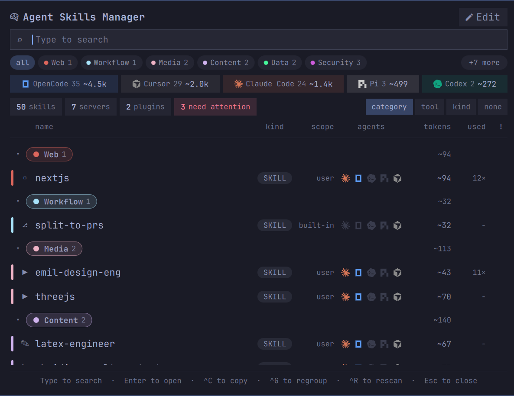

The boxes across the top count it three ways — by agent, by kind, by what is flagged — and each of
them is also a filter. The five agent boxes rarely agree, and the disagreement is the point. On the
machine these screenshots come from, OpenCode carries **35** items for **~4.5k** tokens a turn,
Cursor **29** for **~2.0k**, Claude Code **24** for **~1.4k**, Pi **3** for **~499** and Codex **2**
for **~272** — one set of files, five very different bills.

The overlap is not a rounding error. Cursor reads Claude Code's skill directory, Codex's and the
shared one; OpenCode reads two of the same. Most of what you installed for one agent is being paid
for by several.

An Omarchy 4 (Quattro) shell plugin (`bar-widget`). It needs `omarchy-shell` and `python3`, which a
stock Omarchy install already has.

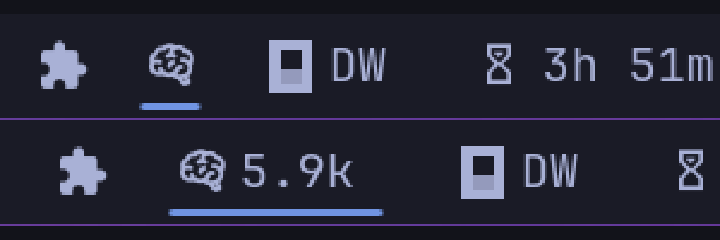

The mark is what you click. Beside it the bar can carry one figure, and the one worth carrying is
above: what every skill listing adds to every turn before you have typed a word, for the agent you
are actually running. The default is the mark alone, because a bar is contested space — leave the
label off and nothing runs until you open the panel.

---

## Install

```
omarchy plugin add https://github.com/oliwier-xiao/agent-skills-manager.git --enable
```

`--enable` puts it straight on the bar and asks which side you want it on. Leave the flag off to
install it disabled, read the code first, and turn it on later with `omarchy plugin enable
oliwier.agent-skills-manager`.

## What it reads, what it writes

It reads the ten directories the five agents keep skills in, plus the skills inside installed Claude
Code plugins, the settings files that say which agent has what turned on, the MCP server
configuration, and `/proc/<pid>/comm` to see which agent is running.

| Root | Read by |
|---|---|
| `~/.claude/skills` | Claude Code, Cursor, OpenCode |
| `~/.config/opencode/skills` | OpenCode |
| `~/.codex/skills` | Codex, Cursor |
| `~/.agents/skills` | Codex, Cursor, OpenCode |
| `~/.cache/opencode/skills` | OpenCode |
| `~/.pi/agent/skills` | Pi |
| `~/.cursor/skills` · `skills-cursor` · `cloud-skills` | Cursor |
| `~/.grok/skills` | Cursor |

Those are the defaults, not the answer on every machine. OpenCode resolves its own through the
environment and the panel follows it rather than guessing: `XDG_CONFIG_HOME` **moves** the config
root and the skills root with it, `OPENCODE_CONFIG_DIR` **adds** a second one, `XDG_CACHE_HOME` and
`XDG_DATA_HOME` move the fetched-skills root and the MCP token file, and `OPENCODE_CONFIG` and
`OPENCODE_CONFIG_CONTENT` each merge a further configuration in. Where `opencode.jsonc` sits beside
`opencode.json`, the `.jsonc` is the one OpenCode loads — so it is the one read here, and the other
is reported as shadowed rather than quietly used instead.

Cursor is the greediest reader on the machine and the reason a row can carry five marks: its own
bundle names nine skill directories, four of which belong to other agents. Pi is the opposite and
reads nobody else's.

It writes two files, both its own and both under `~/.config/agent-skills`:

| Path | What is in it |
|---|---|
| `categories.json` | the categories you filed things under, their order, and whether the **placed by** line is on |
| `descriptions.json` | your notes — your own words about a skill, which no agent ever reads |

**Nothing else is written at all.** No `SKILL.md` is opened for writing, no agent's configuration
file is touched, nothing is deleted or moved, and no other program is started — the helper contains
no subprocess. What an agent loads on its next turn is not this widget's to change, and the test
suite asserts that rather than promising it.

---

## The panel

Each row says what the thing is, which agents see it, what it costs, and how often you have reached
for it. The coloured bar down the left is its category.

The name has a column of its own and the rest follow it from the left, so `kind`, `scope` and
`agents` start at the same place on every row however long that row's name is. A name longer than
its column wraps to a second line and then elides; the row grows only when it wraps.

### Inside a row

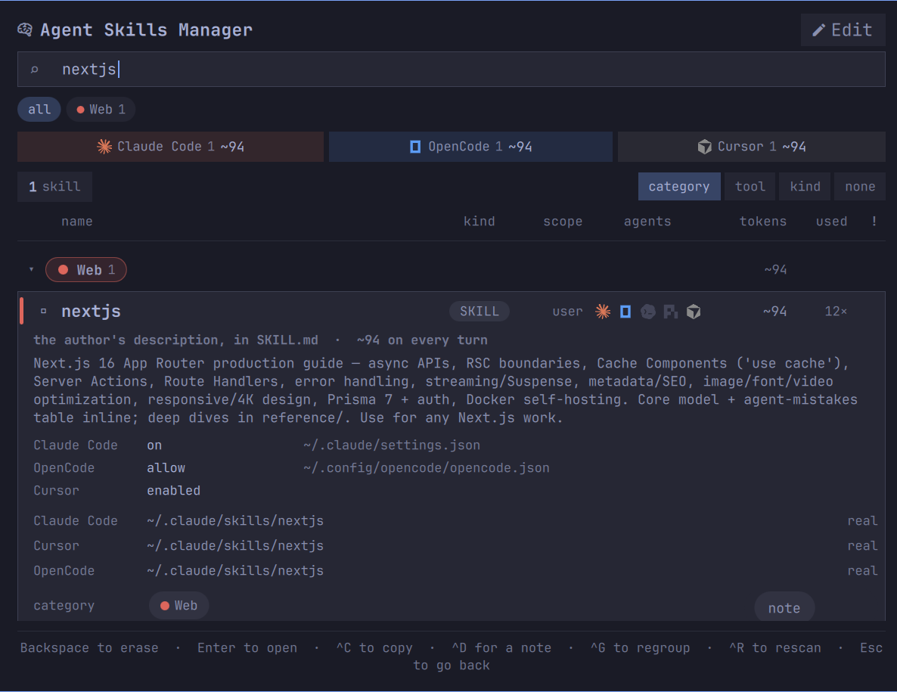

Open a row and it stops summarising. The description is the one the agents actually read — the text
costing you the tokens in the corner. Under it, the state each agent has this skill in and **the
file that state is written in**, so a claim on this panel is one you can go and check. Cursor's line
names no file, because Cursor ships no per-skill switch to name.

Then every path it is reachable from, marked `real` or `symlink`; its category, as a control you can
click; the invocation for each agent; how the category was chosen and how confident that guess was;
the version its author declared, where one is declared at all; the content hash the drift check
compares; and the token figure with the divisor that produced it. **note** sits in the corner.

Nothing here is checked against anywhere upstream. A skill directory is not a checkout — it has no
remote, no recorded commit and usually no version — so there is no honest way to say whether a newer
one exists, and the panel does not pretend otherwise. Where two copies of one name declare different
versions, that is reported as drift, which is a comparison between two things it can actually see.

### One skill, five agents

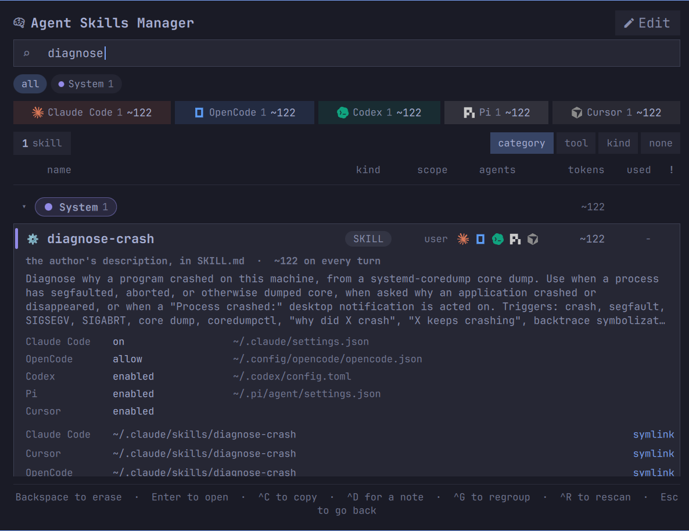

`diagnose-crash` is a single `SKILL.md` under `/usr/share/omarchy`, reached from `~/.claude/skills`,
`~/.codex/skills`, `~/.agents/skills` and `~/.pi/agent/skills` — and because OpenCode reads two of
those and Cursor reads three, all five agents load the same file. It is one row carrying five agent
marks, not five rows repeating themselves. Two copies that share a name and have stopped sharing
their contents are told apart by content hash and flagged as drift.

### What gets flagged

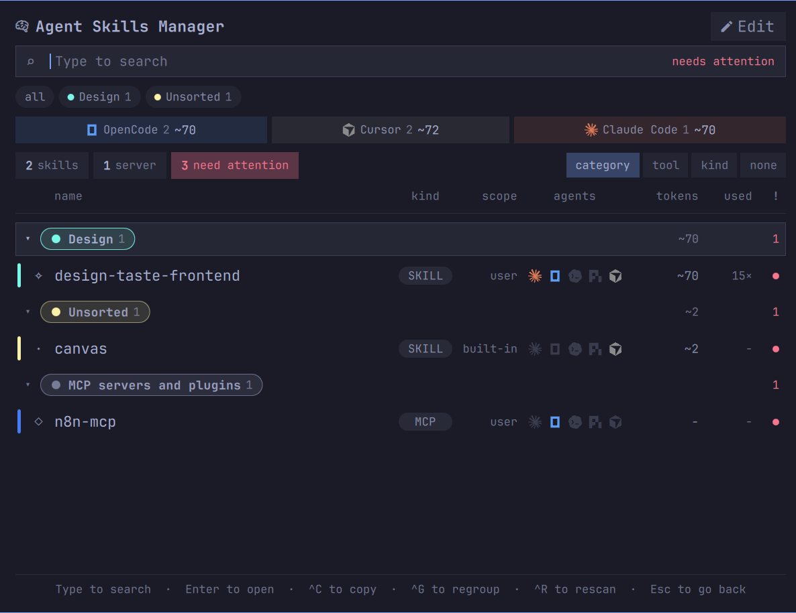

`!` shows only what needs looking at, and every count in the header narrows with it. **A skill
answering to two names:** the directory is `taste-skill`; the `SKILL.md` inside declares
`name: design-taste-frontend`. Claude Code invokes a skill by its directory, the other four by the
name it declares — so the same file is `/taste-skill` in one and `/design-taste-frontend` in the
rest. Copy the wrong one and nothing happens, with no error to say why. The row carries both,
against the agent each belongs to.

**A server whose token has expired:** `n8n-mcp` is remote and its stored credentials have run out,
and OpenCode will not say so until the moment you need it.

The list stays quiet about everything else. A category the classifier was unsure of is not a
problem, and is not reported as one.

---

## Copying the command

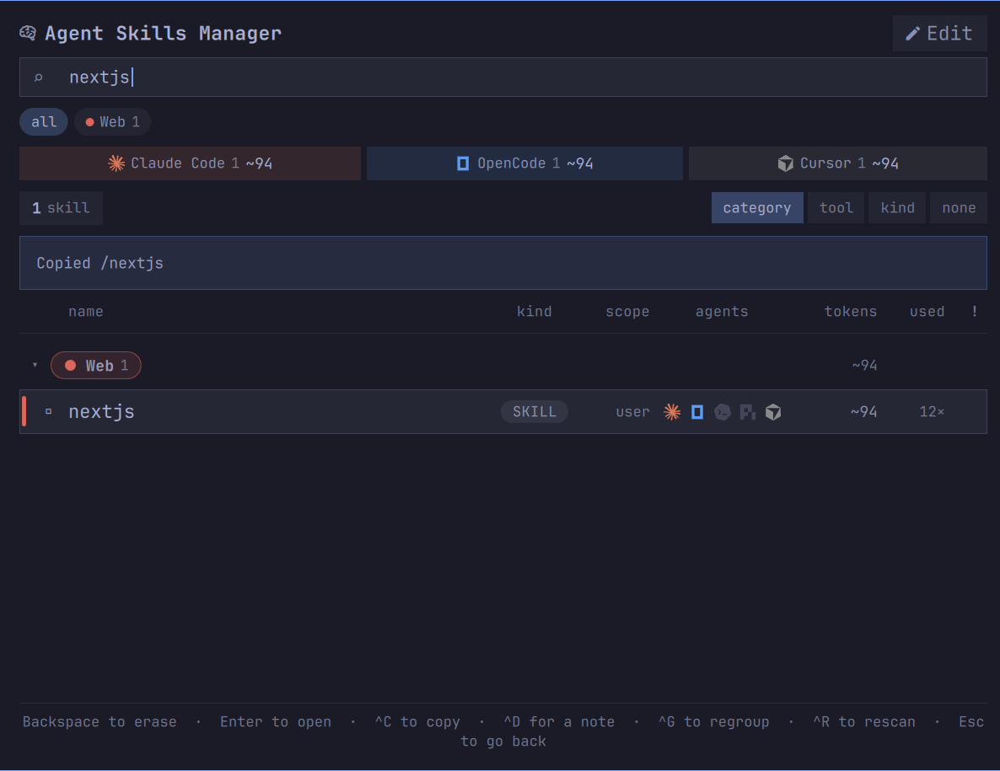

`^C` puts the invocation on your clipboard in the spelling the agent under the cursor expects. Five
agents, five spellings, and only Claude Code keys by the directory:

| Agent | Invocation |
|---|---|
| Claude Code | `/<directory>` |
| OpenCode | `/<declared name>` |
| Codex | `$<declared name>` |
| Cursor | `/<declared name>` |
| Pi | `/skill:<declared name>` |

Nothing is claimed until it happens: the panel writes, reads back, and says **Copied** only when the
read agrees. It says **Sent to the clipboard** where it had to shell out and cannot read the result
back, and if neither path was reachable it says so in red and prints the command for you to select
by hand.

A skill arriving inside a Claude Code plugin is addressed through it, so that row copies
`/impeccable:impeccable` rather than `/impeccable`. Which version is read is not guessed either —
the cache can hold several, and `installed_plugins.json` records the one Claude Code actually
loaded.

### Skills that take arguments

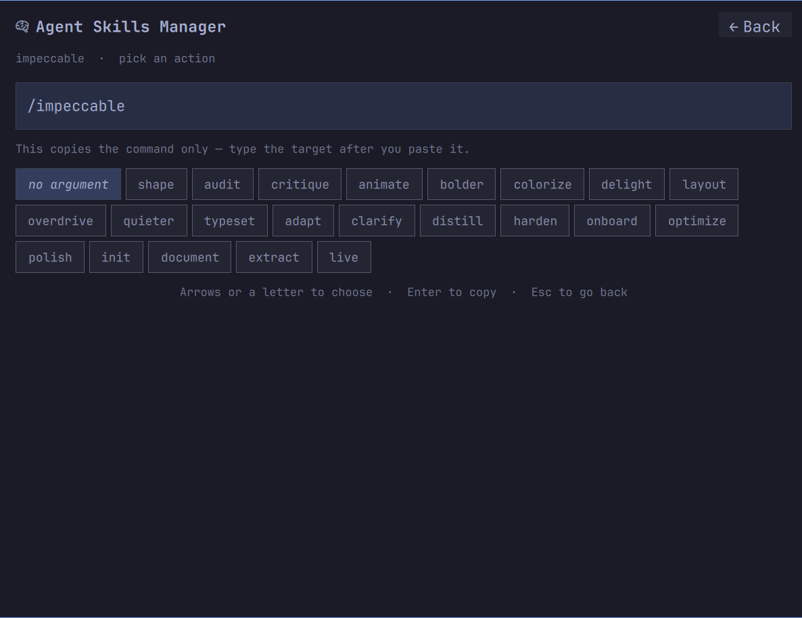

A skill that takes arguments says so in its frontmatter, in `argument-hint`. `impeccable` documents
twenty-two of them, so copying that row and getting `/impeccable` on its own is not what anybody
wanted. The row says **22 actions** beside its name and `^C` opens them as a grid instead.

The assembled command is drawn above the options at reading size and updates as you move, so what
will land on your clipboard is on screen before you press Enter. Arrows move; a letter jumps to the
next action starting with it. **no argument** is the first option, because sometimes the bare
command was the point. Rows without documented arguments copy straight through.

---

## Categories

Which category a skill belongs in is the one thing about it that is yours, and there is nowhere in
any of the five agents to say so. Fourteen are guessed from the description, and a skill the rules
cannot place lands in **Unsorted** rather than being pushed into whichever one was the residual.

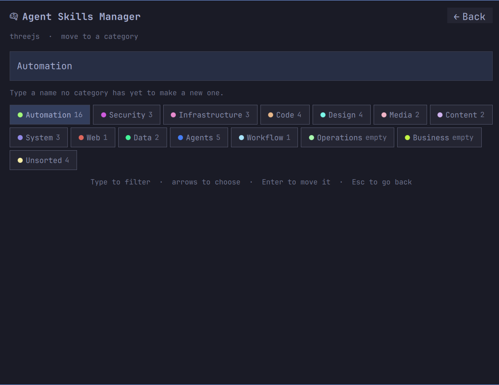

`^M` moves a row, and an expanded row shows its category as a control — so the correction sits next
to the thing being corrected. Type a name nothing answers to and it becomes a new one.

An expanded row says how it was filed on its **placed by** line — the marketplace listing, the
skill's own frontmatter, where it is installed, its description and how sure that was, or you. It is
worth reading while you are deciding whether to trust the filing, and repetition on every card
afterwards, so the `×` at the end of the line turns it off everywhere at once. The category index
carries a **show placed by** chip while it is off, and that is the way back.

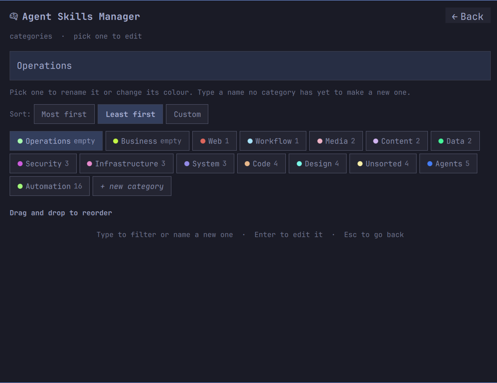

**Edit**, opposite the title, opens all of them at once with a standing **+ new category** at the
end — the way in when the one you want is not on screen, or does not exist yet. `^E` does the same
from the keyboard. **Sort** orders the shelves by size or by an order of your own, and the chips
themselves drag into place.

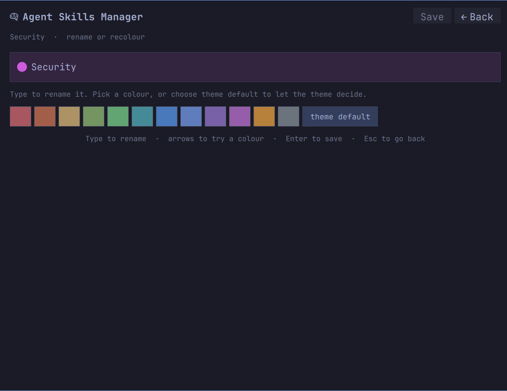

Pick one and you can rename it, recolour it, or clear the colour and fall back to the theme's.
Trying a colour on is not choosing one: swatches preview against the category's own name as you
arrow through them, and **Save** commits.

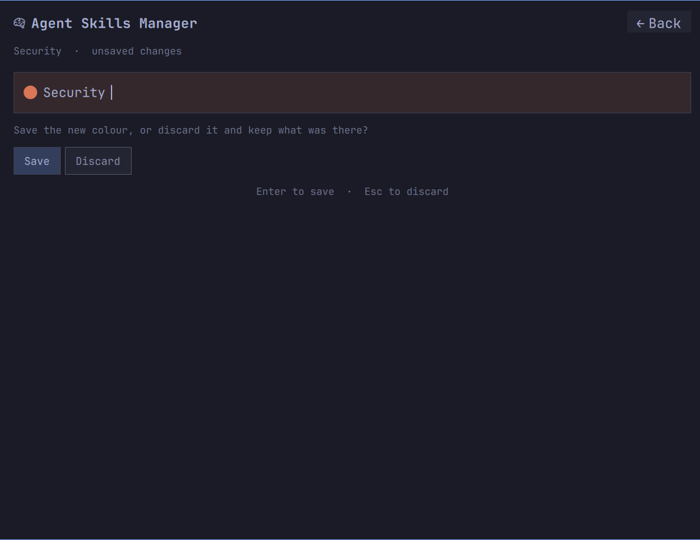

Backing out with something unsaved asks first, on the same surface, rather than dropping work you
had no way of knowing was still a draft.

---

## Your own notes

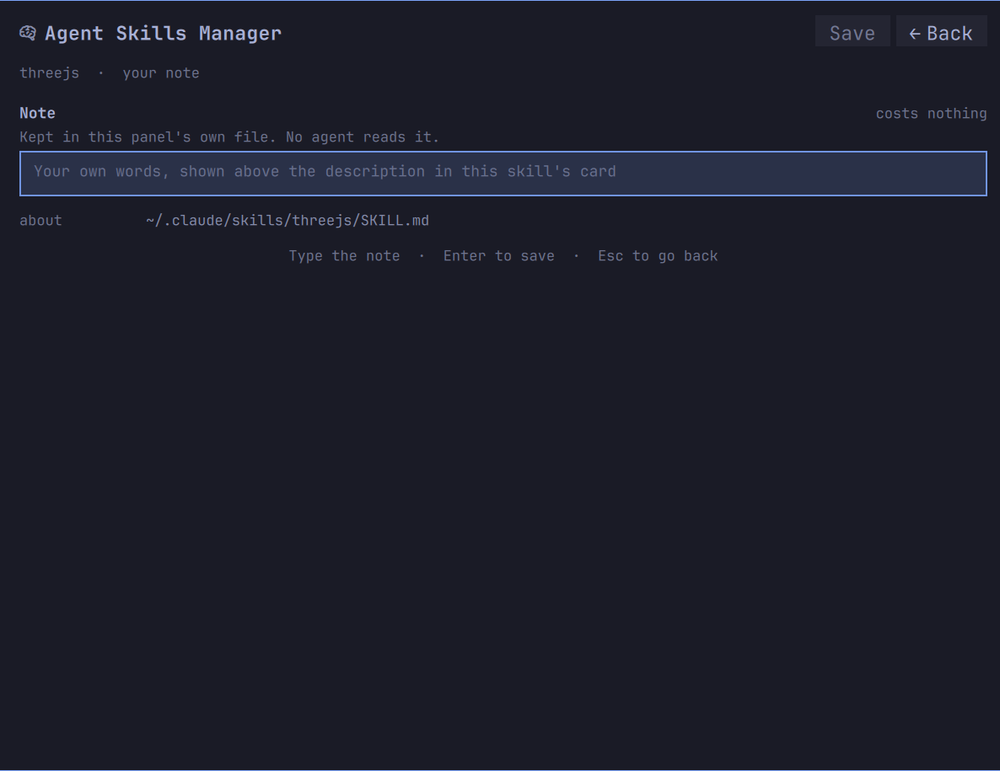

`^D` on an open row, or **note** in the corner of its card. It starts empty, it is drawn above the
description in that skill's card, no agent ever sees it, and it is in no figure anywhere. Write what
the skill is for in your own words, or in your own language — the search reads it too.

It is kept in this widget's own file and filed under the skill's name, so every copy of a name shows
the same note. Leaving the field empty clears it; that is the only way one goes.

The description underneath it is the file's own, shown as it stands. This widget reports it and does
not write it: what an agent loads on its next turn is not a bar widget's to change, however good the
confirmation. If a description is costing you more than it earns, the file is `SKILL.md` in the path
the card names, and your editor is the right tool for it.

---

## Search and filters

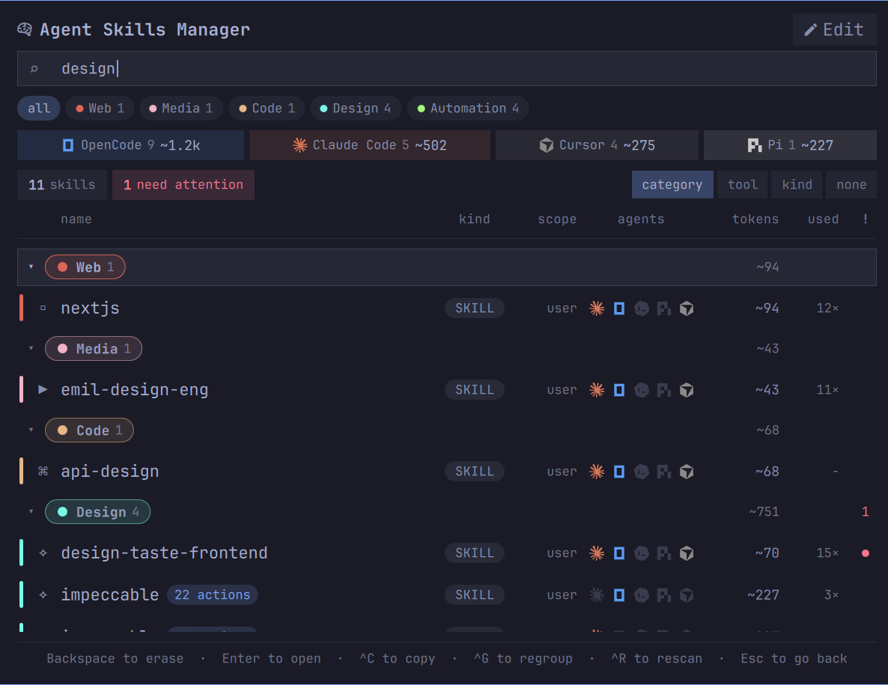

Every printable key goes to the search, including the first, so a skill starting with `c` or `g` is
reachable by typing it; commands take Ctrl. The search reads names, descriptions, your notes,
categories and tags. Every box along the top is a filter, and so is every category chip below them —
clicking the one already on turns it off, `all` clears them, and Escape does the same.

`all` stays on screen for as long as there is a filter to undo, even where the shelves it sits
beside have nothing left to show. Categories belong to skills alone, so filtering to servers empties
that row — and a filter you can set with the mouse and can only clear with the keyboard is a trap.

The counts stay honest as you narrow. Each dimension is counted with every filter except its own, so
picking `servers` leaves the skills box reading its real total rather than 0, and a box that would
filter to nothing is not drawn at all.

### Grouping

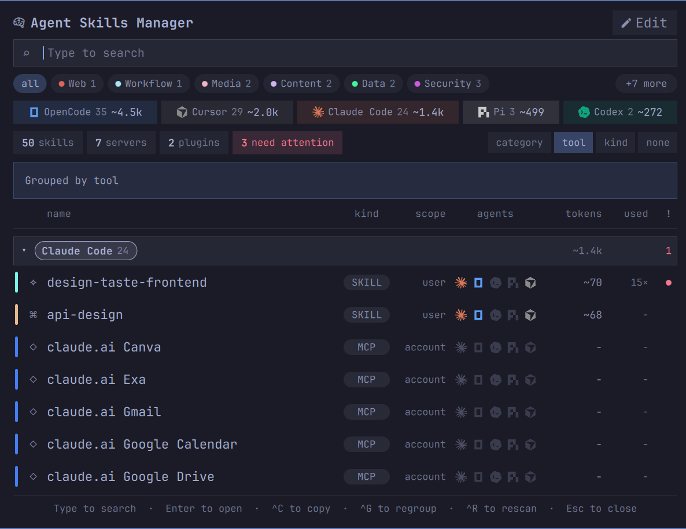

By category answers the question you open the panel with — where is the thing that does X. By tool
is right when you are about to switch agents and want to know what that one alone can see. By kind
separates skills from plugins from MCP servers. None gives one flat alphabetical list, which is the
fastest thing to type-search through.

Four boxes beside the counts take one click to any of them, and `^G` cycles the same four. Fewer
than four once you have filtered, because a grouping you have already filtered by is not a grouping:
pick one agent, and grouping by tool is a heading over a list that is entirely that agent. Each box
steps aside for as long as its filter is on and comes back when you clear it.

---

## MCP servers and plugins

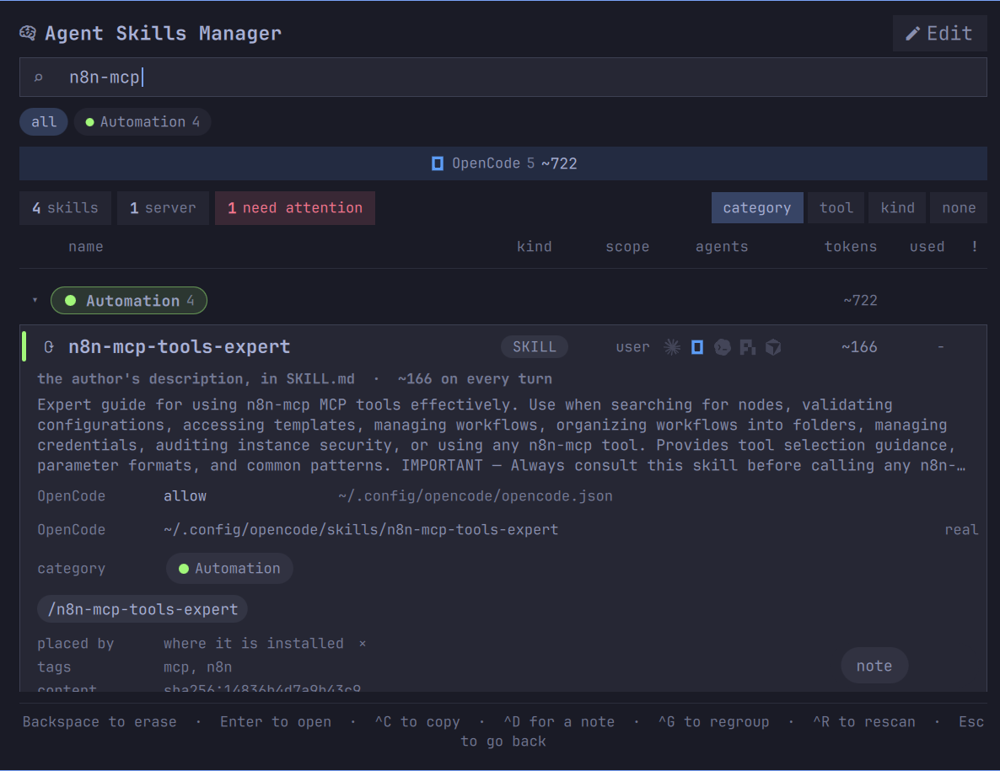

MCP servers are listed beside skills because they load the same way and cost the same kind of money.
Local ones are read from the config files that declare them. Claude Code's account connectors are
not on disk at all; when they cannot be reached, the names Claude Code has recorded are shown with
the source that supplied them, and the row says so rather than inventing a state.

A server's command line can carry a credential, so anything secret-shaped in it — a header, a token
flag, a key in a URL — is replaced before it can be drawn. Servers are read-only in this version,
and every row says so where you would otherwise expect a switch.

## The token figure

The length of the name, description and when-to-use joined, divided by four, rounded half up —
computed the way Claude Code's own extensions browser computes it. On this machine that reproduces
fourteen of the fifteen figures the browser shows, to the token. That is the number in each row, and
the per-agent total in the boxes at the top; a skill an agent can see is in its system prompt on
every turn whether or not you use it.

The setting offers a divisor of three instead, closer to how newer models tokenise dense technical
prose and therefore closer to what you are really paying; the default matches the browser so the two
agree.

---

## Keys

| Key | What it does |
|---|---|
| type | search everything: names, descriptions, your notes, categories, tags |
| `Enter` | open the row, or fold and unfold a group header |
| `^C` | copy the invocation, or pick an action first if the skill documents any |
| `^M` | move the row to another category, or restyle the category under a group header |
| `^E` | open the categories: rename one, recolour it, or add one |
| `^O` | open where the skill is installed, in your file manager |
| `^D` | write your own note about the row |
| `^G` | regroup by category, tool, kind or nothing |
| `^R` | read everything again |
| `!` | show only what needs attention, while the search is empty |
| `Esc` | back out one step: the open row, then the filters, then the search, then close |
| `Tab` | move to the next panel on the bar; Shift-Tab the previous |

## Settings

Five, in the widget's own settings panel.

| Setting | Default | What it decides |
|---|---|---|
| Next to the bar icon | Nothing | whether the bar carries the always-on token figure for whichever agent is running, the number of skills, the count of what is flagged, or nothing |
| Group the list by | Category | the grouping the panel opens on |
| Show built-in skills | off | whether the skills each agent ships with are counted; you did not install them and cannot turn them off, so by default only your own things are |
| Estimate token cost as | chars/4 | the divisor, or hiding the figure entirely |
| Rescan every time the panel opens | on | turn it off only if you keep skills on a network mount, where a stat of every file is no longer free |

## Requirements

Omarchy 4 with its Quickshell bar, and `python3` at `/usr/bin/python3` — the standard library only,
no Python package to install. The panel spawns that path outright rather than letting a shebang
search `PATH`; if yours is elsewhere, the panel opens empty while the helper still works in a
terminal.

Whichever of the five agents you actually use is the one you get rows for. An agent that is not
installed is one quiet line saying so, not an error.

## Update

```
omarchy plugin update oliwier.agent-skills-manager
omarchy restart shell
```

The restart is not optional. The shell reloads a plugin by re-reading its directory, but a QML
component it has already built keeps the code it was built from — so the widget on your bar goes on
running the old version, with nothing to tell you: the new files are on disk and `omarchy plugin
list` shows the new number. It is a known Quickshell component-cache limitation, reported upstream
several times over.

## Remove

```
omarchy plugin remove oliwier.agent-skills-manager
```

Your own files outlive it, so reinstalling later finds your filing and your notes again. To clear
them:

```
rm -rf ~/.config/agent-skills
```

That is the two files named at the top of this README, and nothing else — every skill on the machine
is exactly where it was.

## The command line

The panel draws; `bin/agent-skills` does every byte of the reading and both of the writes — the
category store and the description. It is worth running on its own, and it counts skills only, where
the panel's agent boxes count everything an agent loads.

```
bin/agent-skills doctor
```

```
agent-skills 1.0.0   scan 27.2 ms
skills            56
  claude          16   ~1406 tok always on
  codex            8   ~808 tok always on
  cursor          35   ~2520 tok always on
  opencode        34   ~4460 tok always on
  pi               3   ~499 tok always on
mcp servers       7
claude plugins    2
running now       claude, opencode
categories        automation 16, agents 10, code 5, design 4, unsorted 4, infra 3, security 3, system 3, content 2, data 2, media 2, web 1, workflow 1
```

`bin/agent-skills scan` prints the same inventory as one line of JSON, which is what the panel
reads; `--pretty` indents it and `--divisor 3` re-costs it.

`bin/agent-skills category` writes only `~/.config/agent-skills/categories.json`, and every verb is
a single named change to it:

```
bin/agent-skills category list
bin/agent-skills category create ui --label UI --color '#7AA2F7'
bin/agent-skills category assign nextjs ui
bin/agent-skills category unassign nextjs
bin/agent-skills category style ui --reset
bin/agent-skills category placed-by hide
```

`bin/agent-skills describe note` is the other write, and it goes to the widget's own store where no
agent reads it. Leave the text off to clear the note that is there:

```
bin/agent-skills describe note nextjs 'why I keep this'
bin/agent-skills describe note nextjs
```

Those two verbs are the whole of what this program writes. There is no third, and there is no
subprocess: `scan` and `doctor` read, and everything they report about a skill is reported as it
stands.

Every file read under a scanned root is opened once with `O_NOFOLLOW` and `O_NONBLOCK` and judged on
that descriptor rather than on its name, because `omarchy-shell` is one process for the whole
desktop and nothing read on its behalf may block or turn out to be larger than it said it was. A
file that is refused is reported as refused rather than treated as absent: an empty list and a list
that could not be read look identical and mean opposite things.

## Development

Tests are plain `unittest` and need nothing that is not already here.

```
python3 -m unittest discover -s tests -v
```

`tests/preflight.sh` checks this repository against the Omarchy plugin marketplace's published rules
— the structural validator, the automated security baseline, and the recurring demands of its manual
review — and exits non-zero on any violation. It also runs `qmllint` against every QML document with
the `qs` module resolved, under a per-file warning ceiling, because a gate pointed at the wrong
import path measures the import failure rather than the document. CI runs it on every push and pull
request, so run it before proposing a change and meet it locally rather than on the branch.

## License

MIT. See [LICENSE](LICENSE).
